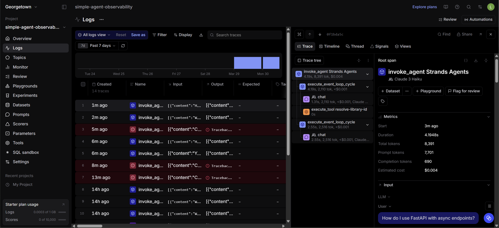

# MCP Observability Analysis

*Screenshot showing a Context7 MCP tool invocation in a Braintrust trace.*

I connected to the Context7 MCP server because it is a public MCP server that provides tools for documentation lookup. I used it together with the DuckDuckGo search tool in my Strands agent. When I asked a technical question about FastAPI async endpoints, Braintrust showed that the agent invoked a Context7 MCP tool during the run.

One thing I noticed in the Braintrust trace was that the MCP tool call appeared in the trace tree as a separate tool execution span between model calls. This made it easy to see how the agent first interpreted the question, then used the MCP tool, and finally generated a response based on the result. Compared with DuckDuckGo, the MCP tool looked more targeted for programming documentation, while DuckDuckGo was better suited for general search and broader web information.