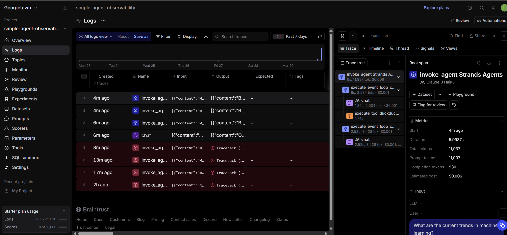
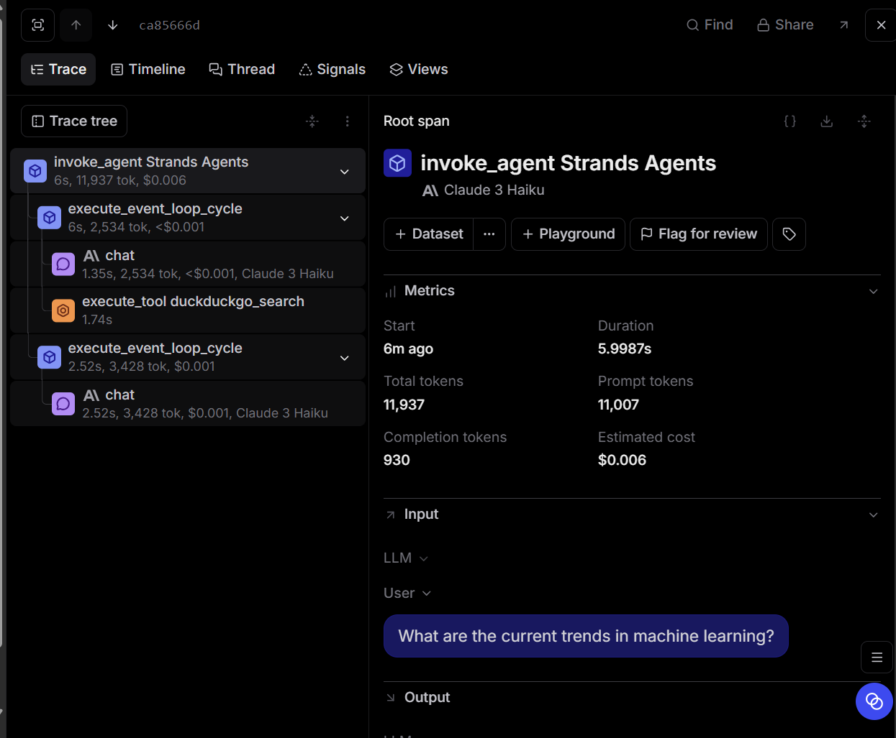
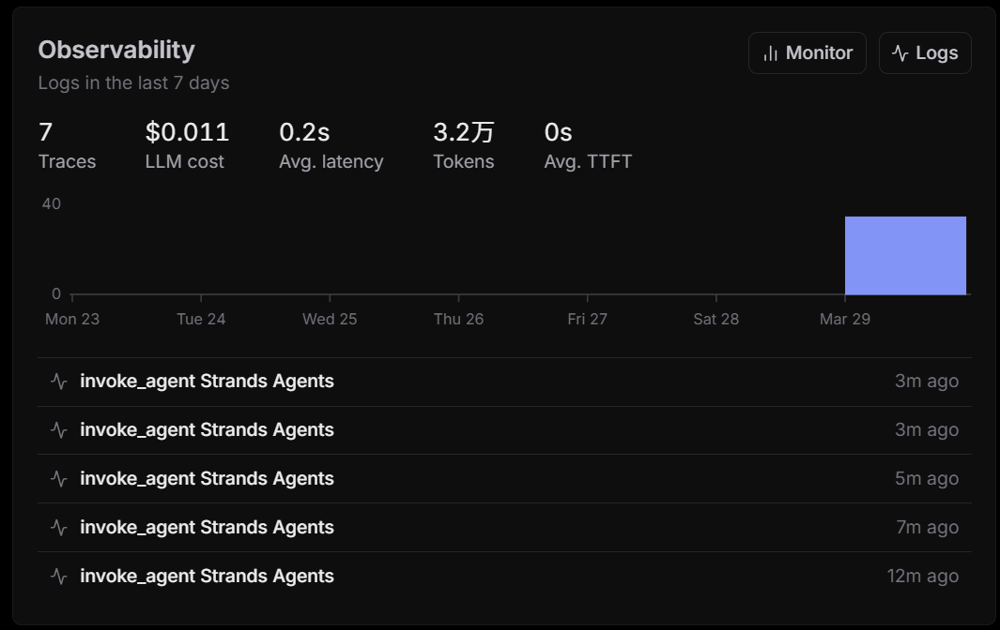

# Braintrust Observability Analysis

## Observations from the Logs View
This view provides an overview of the Logs. Braintrust records multiple agent runs, where individual traces can be in one of two states: successful or failed. Each trace contains details such as the timestamp, name, and input/output data. From this overview page, you can quickly identify the volume of recent runs and pinpoint exactly which calls encountered errors. The fact that the Logs page displays multiple distinct traces indicates that a new run record is generated for every query submitted. Since this page allows you to view not only successful calls but also previous failed ones, it is an ideal tool for troubleshooting. Furthermore, the list view enables you to compare the execution times and output results of different runs side-by-side.

*Caption: Logs view showing multiple agent traces across different runs, including both successful and failed executions.*

## Observations from a Single Trace
This diagram presents a detailed hierarchical view of a single trace. An agent's execution does not consist of a single step, but is rather composed of multiple spans. The root span represents the agent invocation, beneath which you can observe the chat span and the tool span. These encompass the model's chat calls as well as the invocation of the DuckDuckGo search tool, clearly illustrating how the tool is embedded within the agent's workflow. After the DuckDuckGo search tool is invoked, the model proceeds to synthesize a response. This demonstrates that the agent follows a process of "first thinking—or invoking tools—and then generating the final answer." This hierarchical structure makes it much easier for me to understand how the agent first performs a search and subsequently generates its final response based on the search results.

*Caption: Detailed trace view showing the span hierarchy for one run, including model calls and the DuckDuckGo search tool.*

## Metrics and Performance Patterns
This image displays the metrics and observability dashboard. As the visual indicates, Braintrust tracks the volume of traces. The metrics page presents data on traces, tokens, latency, and cost—demonstrating that Braintrust goes beyond merely logging processes; it also facilitates performance analysis. I observed a correlation between token count and cost: generally, the more complex the operation, the higher the resource consumption. These metrics are invaluable for comparing the overhead and response efficiency of different queries.

*Caption: Metrics dashboard summarizing trace count, token usage, latency, and estimated LLM cost.*